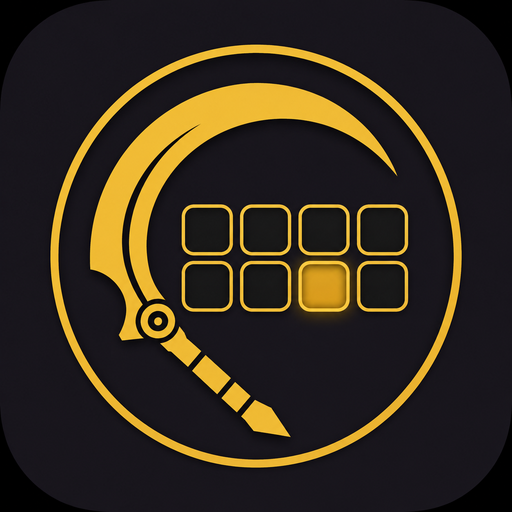

<p align="center">
  
</p>

<h1 align="center">gw1-mcp</h1>

<p align="center"><em>A Guild Wars 1 build compiler for LLMs</em></p>

An MCP (Model Context Protocol) server that gives any compatible LLM client
(Claude, ChatGPT, Cursor…) reliable, deterministic knowledge of **Guild Wars 1**
builds: skill data lookup, official template code encoding/decoding, and build
validation.

**The MCP is a compiler, not a brain.** The LLM does the strategic reasoning;
this server does the things that must be exact.

## Tools

| Tool                       | Purpose                                                                                           |
| -------------------------- | ------------------------------------------------------------------------------------------------- |
| `get_skill`                | Full record for one skill (by exact name or template id), with closest-match suggestions on typos |
| `search_skills`            | Filtered search: profession, attribute, campaign, elite, name substring                           |
| `decode_template`          | In-game template code → professions, attributes, 8 skills with stats                              |
| `encode_template`          | Named build → validated, official in-game template code                                           |
| `validate_build`           | GW1 rule check: one elite max, profession/attribute ownership, primary attributes, duplicates     |
| `get_hero` / `list_heroes` | Heroes with professions, campaigns and unlock notes                                               |
| `decode_pawned_team`       | paw-ned2 team blobs (PvXwiki team pages) → every bar decoded                                      |

Resources: `gw1://guide/build-workflow` (methodology for the LLM) and `gw1://heroes`.

## Quick start

```bash
pnpm install
pnpm -r test
pnpm --filter @gw1-mcp/gw-mcp dev   # stdio server
```

## Packages

- `packages/gw-template` — template code codec (zero dependencies; round-trip tested against in-game/PvX codes and differentially fuzzed against [@buildwars/gw-templates](https://github.com/build-wars/gw-templates))
- `packages/gw-data` — game data (1484 skills, Reforged-current) imported from [build-wars/gw-skilldata](https://github.com/build-wars/gw-skilldata) (MIT)

The codec is verified four ways: 18 golden fixtures covering all 10 primary
professions and all 5 campaigns (sourced from PvXwiki, gw1builds.com, the
official wiki and the pre-2007 in-game format, several verified down to the
skill-id level), fuzzed round-trips, differential testing against an
independent implementation, and malformed-input rejection tests. Validation
rules are table-tested one by one. `pnpm test:coverage` for the numbers.

- `packages/gw-mcp` — the MCP server (transport-agnostic core + stdio entry)
- `packages/gw-worker` — Streamable HTTP wrapper (Hono), runs on Cloudflare Workers and Node

## Deploy to Cloudflare Workers

```bash
pnpm --filter @gw1-mcp/gw-worker check    # offline bundling validation
pnpm --filter @gw1-mcp/gw-worker deploy   # needs `wrangler login` once
```

The server is stateless (a fresh McpServer per request over bundled data), so it
fits the Workers model with zero configuration: no Durable Objects, no KV, no
secrets. Free plan is plenty.

## Connect it

- **claude.ai / Claude app**: Settings → Connectors → Add custom connector →
  `https://gw1-mcp.<your-subdomain>.workers.dev/mcp`
- **Claude Code**: `claude mcp add --transport http gw1 https://…/mcp`
  or locally over stdio: `claude mcp add gw1 -- pnpm --filter @gw1-mcp/gw-mcp dev`
- **Local HTTP without Cloudflare**: `pnpm --filter @gw1-mcp/gw-worker dev:node`
  then point any client at `http://localhost:8787/mcp`

## Regenerating game data

```bash
pnpm --filter @gw1-mcp/gw-data update @buildwars/gw-skilldata --latest
pnpm --filter @gw1-mcp/gw-data run import:data
# or, to import the upstream's published release files (what the weekly workflow does):
pnpm --filter @gw1-mcp/gw-data run import:data -- https://build-wars.github.io/gw-skilldata
```

## GWToolbox integration

`gwtoolbox-plugin/` contains a read-only GWToolbox plugin adding
`/exportaccount`: it copies your account state (heroes, unlocked skills) as JSON to
the clipboard. Paste it in your conversation and pass `unlockedAccountSkills`
to `validate_build` / `encode_template` as `unlockedSkillIds` — proposed
skills you don't own are flagged. Windows build instructions in
[gwtoolbox-plugin/README.md](gwtoolbox-plugin/README.md).

## Roadmap

MCP resources for build archetypes and hero constraints, hero availability
from campaign progression, and upstreaming the account export into GWToolbox
itself. See `CLAUDE.md` for the full architecture notes.

---

_This project is not affiliated with ArenaNet or NCSoft. Guild Wars is a
trademark of NCSoft Corporation. Game data courtesy of the
[build-wars/gw-skilldata](https://github.com/build-wars/gw-skilldata) project
(MIT) and the format documentation on the
[Guild Wars Wiki](https://wiki.guildwars.com/wiki/Skill_template_format)._

## Development

```bash
pnpm install && pnpm -r test
```

Node >= 22, pnpm 11. Nothing builds to dist — exports point at the .ts
sources and the worker bundles via wrangler. See
[CONTRIBUTING.md](./CONTRIBUTING.md) to get started and
[CLAUDE.md](./CLAUDE.md) for the full architecture, conventions and the
honest register of known debts.

## License

MIT
